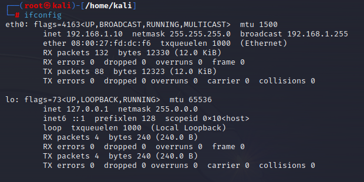
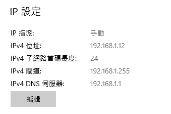
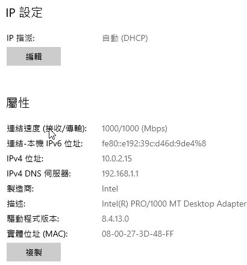
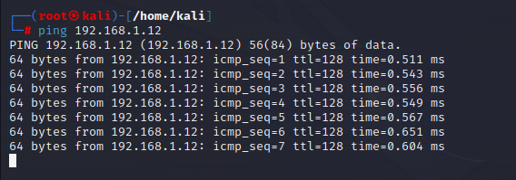

# Phishing-with-DNS-spoofing
A Phishing website (fack facebook login page) and DNS spoofing demo
## Environment
- [x] Virtual box
- [x] Host VM x 2 (attacker should be kali, victim can be any OS which can use browser)
- [x] Attacker connects to internal network; victim connects to NAT and internal network
- [X] A fack facebook login page

## Setup
### Attacker 
- OS: kali
- Internal network (ip address: 192.168.1.10)

### Victim 
- OS: Windows 10
- Internal network (ip address: 192.168.1.12)
#### 
- External network (ip address: 10.0.2.15)
#### 
### Connection Test 
- Two VMs can connect to each other (attacker pings victim)
#### 
- The victim can connect to real facebook login site 

## Deploying Phishing Sites
### Updating

## Reference
- https://www.youtube.com/watch?v=4i7kc8cY654
- https://www.kalilinux.in/2019/07/ettercap-dns-spoofing-in-kali-linux.html
- https://github.com/htr-tech/zphisher
