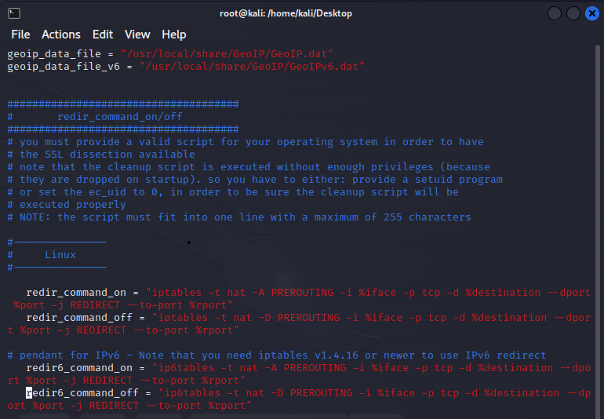
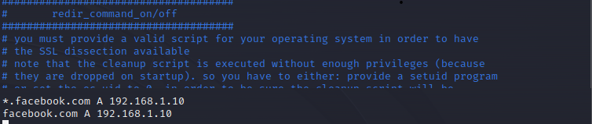
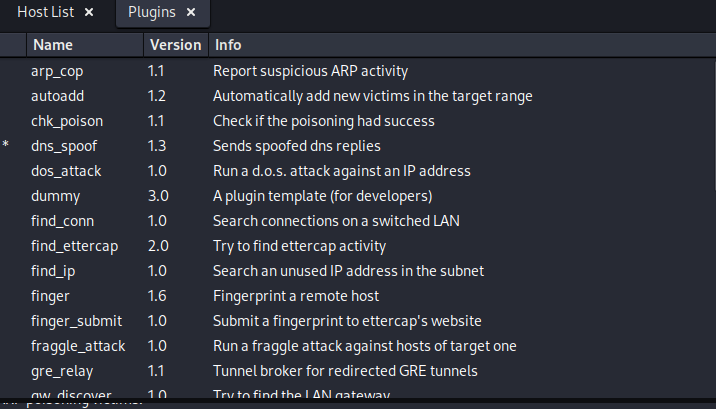

# Phishing-with-DNS-spoofing
A Phishing website (fack facebook login page) and DNS spoofing demo
## Environment
- [x] Virtual box (NAT network is required)
- [x] Host VM x 2 (or more)
- [x] Attacker amd victim both connect to NAT network
- [X] A fack facebook login page

## Setup
### Attacker 
- OS: Ubuntu 22.04 (kali and others that can use ettercap are accepted)
- NAT network (ip address: 10.0.2.4)

### Victim 
- OS: Windows XP
- NAT network (ip address: 10.0.2.7)
- two VMs can connect to each other (attacker pings victim)


## Deploying Phishing Sites
### Deploying a fack facebook site on attacker's localhost
- the source code of the site is based on [zphisher](https://github.com/htr-tech/zphisher)
```bash=
cd site
cp * /var/www/html/
cd /var/www/html/
mkdir data
cd data
touch usernames.txt  
cd ..
chmod -R 777 .     
cd ~
service apache2 start
tail -f /var/www/html/data/usernames.txt    
```
### Open browser 
- the attacker can test by access 127.0.0.1 on browser
#### 
- the victim can also connect to real facebook login site (access 10.0.2.4 on browser)

### ettercap's configurations
```bash=
vim /etc/ettercap/etter.conf 
```
- modify ec_uid, ec_gid = 0
- uncomment linux setting
#### 
```bash=
vim /etc/ettercap/etter.dns 
```
- add facebook.com into target list
#### 

### ettercap DNS spoofing
```bash=
ettercap -G 
```
- stop unified sniffing 
- scan the hosts
- add the vicitms' ip address to target 1
- start MITM attacks: ARP poisoning
- enable dns_spoof plugin
#### 
- start unified sniffing 

### victim is spoofed
- open cmd
```bash=
nslookup facebook.com
ping facebook.com
```
- the ip address of facebook.com becomes 10.0.2.4
- open browser in private mode and access facebook.com
- login!
- the account and password are show on ettercap and usernames.txt 

### Demo 
- attack one victim
[](https://youtu.be/0tiLnDpQlVQ)
- attack two victims
https://github.com/chi-0828/Phishing-with-DNS-spoofing/assets/73067915/28c94978-7d51-44be-b2d6-d5904f4eecf8


## Reference
- https://www.youtube.com/watch?v=4i7kc8cY654
- https://www.kalilinux.in/2019/07/ettercap-dns-spoofing-in-kali-linux.html
- https://github.com/htr-tech/zphisher
